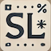

<div align="center">
  
</div>

# SL New Tab

### Summary

This is my personal new tab overide plugin for Google Chrome and Firefox


### Installation

#### Chrome

```
git clone https://github.com/ShaneLee/sl-new-tab.git
open chrome:://extensions
Turn developer mode on (see https://developer.chrome.com/extensions/getstarted)
Load unpacked (select the src folder)
```

#### Firefox

(Developer Edition Only)

```
git clone https://github.com/ShaneLee/sl-new-tab.git
cd src && ./package-firefox.sh
open Firefox about:addons
Click the gearicon and install from file
Open sl.zip in the root of the sl-new-tab directory
```
